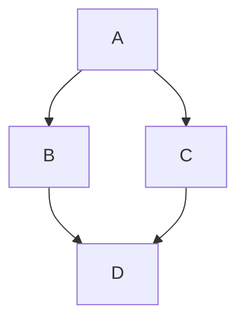

# hexo-markdown-mermaid

A Hexo plugin for rendering Mermaid diagrams in your posts.

[简体中文](./README.zh-CN.md)

## Installation

```bash
npm install hexo-markdown-mermaid
```

## Quick Start

Add mermaid code blocks in your posts:

````markdown

````

## Configuration

### With Syntax Highlighter (Recommended)

Only highlight.js is supported. exclude mermaid so Mermaid.js can render it:

```yaml
highlight:
  enable: true
  exclude_languages:
    - mermaid
```

:::warning
PrismJS is not supported as it does not have `exclude_languages` option.
:::

### Mermaid Options

```yaml
mermaid:
  version: 11
  startOnLoad: true
  theme: default
  # Other mermaid config options...
```

#### Available Options

| Option | Description | Default |
|--------|-------------|---------|
| `version` | Mermaid version | 11 |
| `startOnLoad` | Auto-render on page load | true |
| Other options | See [Mermaid Config](https://mermaid.js.org/config/schema-docs/config.html) | - |

## License

MIT

---

## Technical Details

### Why render in browser instead of build-time?

Mermaid CLI (mermaid-cli) can pre-render diagrams at build time, but it has heavy dependencies (requires Puppeteer or similar), making it unsuitable for most Hexo setups.

This plugin chooses browser-side rendering for simplicity and broad compatibility.

### Why exclude mermaid from syntax highlighter?

When using highlight.js, code blocks are pre-rendered to HTML:

```html
<pre><code class="highlight mermaid">graph TD\nA--&gt;B</code></pre>
```

Mermaid.js defaults to searching for elements with class `.mermaid`:

```html
<pre class="mermaid">graph TD\nA--&gt;B</pre>
```

This mismatch prevents diagrams from rendering. By adding `exclude_languages: - mermaid`, the syntax highlighter skips mermaid blocks, allowing Mermaid.js to render them correctly.

### Mermaid Selector

This plugin uses Mermaid's default query selector `.mermaid`. See [Mermaid RunOptions](https://mermaid.js.org/config/setup/mermaid/interfaces/RunOptions.html#queryselector).
