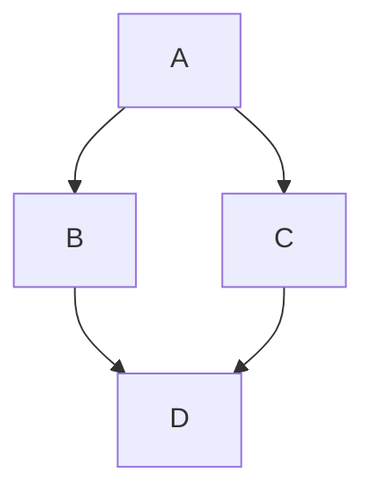

# hexo-markdown-mermaid

Hexo 插件，用于在文章中渲染 Mermaid 图表。

## 安装

```bash
npm install hexo-markdown-mermaid
```

## 快速开始

在文章中添加 mermaid 代码块：

````markdown

````

## 配置

### 使用语法高亮器（推荐）

仅支持 highlight.js。需排除 mermaid 以便 Mermaid.js 渲染：

```yaml
highlight:
  enable: true
  exclude_languages:
    - mermaid
```

:::warning
PrismJS 不支持，因为没有 `exclude_languages` 选项。
:::

### Mermaid 选项

```yaml
mermaid:
  version: 11
  startOnLoad: true
  theme: default
  # 其他 mermaid 配置选项...
```

#### 可用选项

| 选项 | 描述 | 默认值 |
|------|------|--------|
| `version` | Mermaid 版本 | 11 |
| `startOnLoad` | 页面加载时自动渲染 | true |
| 其他选项 | 参阅 [Mermaid 配置](https://mermaid.js.org/config/schema-docs/config.html) | - |

## 许可

MIT

---

## 技术细节

### 为什么在浏览器端渲染而非构建时？

Mermaid CLI 可以在构建时预渲染图表，但它依赖较重（需要 Puppeteer 或类似工具），不适合大多数 Hexo 环境。

本插件选择浏览器端渲染，以保持简洁和广泛兼容性。

### 为什么要排除 mermaid？

使用 highlight.js 时，代码块会被预渲染为 HTML：

```html
<pre><code class="highlight mermaid">graph TD\nA--&gt;B</code></pre>
```

而 Mermaid.js 默认查找 class 为 `.mermaid` 的元素：

```html
<pre class="mermaid">graph TD\nA--&gt;B</pre>
```

这种不匹配会导致图表无法渲染。通过添加 `exclude_languages: - mermaid`，语法高亮器会跳过 mermaid 块，让 Mermaid.js 正确渲染。

### Mermaid 选择器

本插件使用 Mermaid 默认的查询选择器 `.mermaid`。参阅 [Mermaid RunOptions](https://mermaid.js.org/config/setup/mermaid/interfaces/RunOptions.html#queryselector)。
